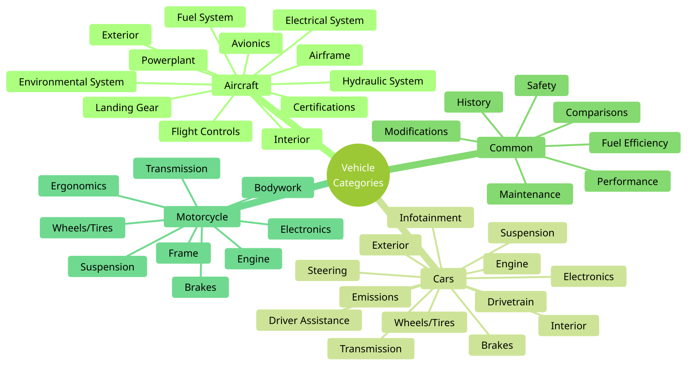

# Article Main and Sub Categories 

- Aircraft
   - Airframe
   - Avionics
   - Certifications
   - Electrical System
   - Environmental System
   - Exterior
   - Flight Controls
   - Fuel System
   - Hydraulic System
   - Interior
   - Landing Gear
   - Powerplant
- Cars
   - Brakes
   - Driver Assitance
   - Drivetrain
   - Electronics
   - Emissions
   - Engine
   - Exterior
   - Infotainment
   - Interior
   - Steering
   - Suspension
   - Transmission
   - Wheels/Tires
- Common
   - Comparisons
   - Fuel Efficiency
   - History
   - Maintenance
   - Modifications
   - Performance
   - Safety
- Motorcycle
   - Bodywork
   - Brakes
   - Electronics
   - Engine
   - Ergonomics
   - Frame
   - Suspension
   - Transmission
   - Wheels/Tires

# Usage

Make sure to run through this list and select the appropriate category and subcategory, so you can store your articles in the correct locations.
