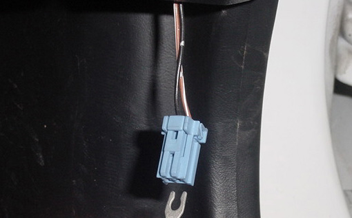

# How To Check Obd1 Ecu Codes

## Location

 On almost all 1988-2000 Hondas, on the passenger side of your vehicle, under the dashboard and beneath the glove box, you will find a green cover above the kickpanel that houses a blue connector with two wires leading up to it. **This is referred to in the service manual as the *SCS* connector.**

## Procedure

What you will need to do is turn the ignition to the off position, and using a stripped piece of wire or paperclip, connect both open ends of the blue connector. Once this is performed, turn the key to the *IGN* position (Second position) and watch your *CEL* light. It will illuminate in a series of flashes.

### Counting the flashes

You will notice that there will be LONG flashes and SHORT flashes. All of the *ECU* trouble codes will be two-digits.
In every case, a long flash will represent the digit 10, simply sum up the long flashes to determine. A short flash will represent the digit 1, simply sum up the short flashes to determine. Sum up the number of 10s and 1s to get the trouble code number.

ie. `LONG-LONG-LONG-SHORT-SHORT-SHORT-SHORT-PAUSE`

...represents the trouble code: **34**

3 LONG flashes followed by 4 short flashes, then a long pause. If that is the only code the *ECU* is throwing, then the code will simply repeat until you remove the key. If, however there are more than one *ECU* error code, then you will see a different series of flashes followed by the long pause. Once all the *ECU* codes have been displayed, they will continuously cycle until you remove the key.

ie. `LONG-LONG-SHORT-PAUSE-LONG-LONG-LONG-LONG-SHORT-SHORT-SHORT-PAUSE`

...represents the trouble code: **21 and 43**

Once you have determined the codes, you can simply remove the paperclip or wire from the connector and replace it back in the green housing.

## Fixing the problem

Now that you have the trouble codes, you may proceed to decipher and troubleshoot the issue.
You can find more information under the "Trouble Codes" section.
